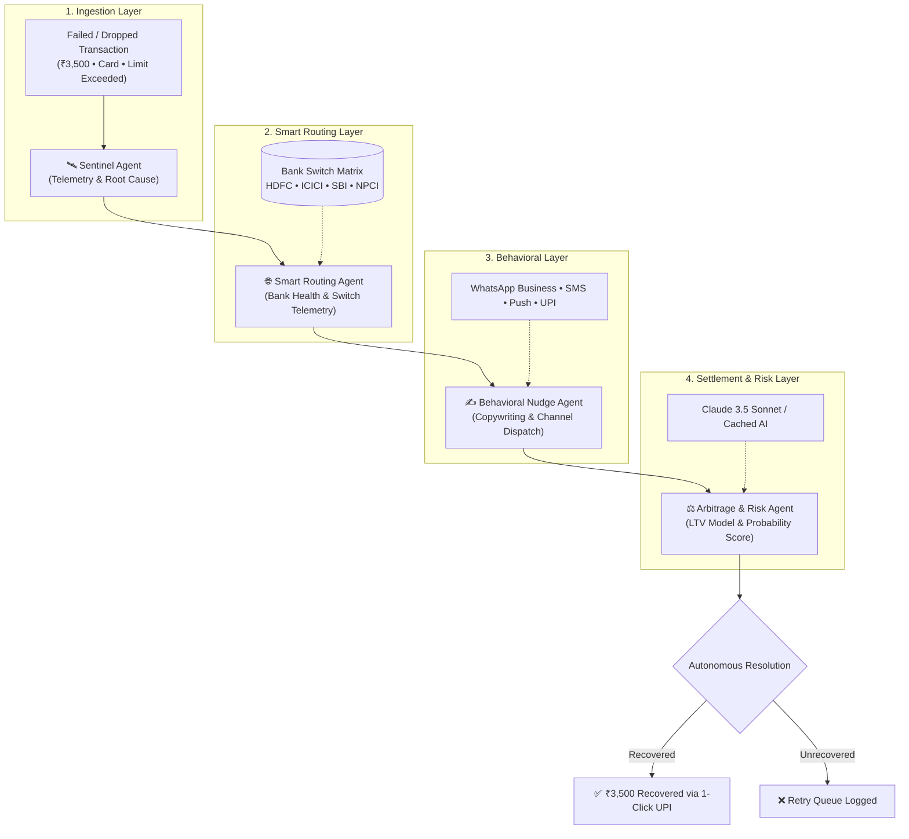

<div align="center">

# 🛡️ Razorpay ResQ
### Autonomous Multi-Agent Payment Failure Interception & Smart Orchestration Engine

[](https://nextjs.org/)
[](https://react.dev/)
[](https://www.typescriptlang.org/)
[](https://tailwindcss.com/)
[](https://anthropic.com/)
[](https://vercel.com/)

<br />

**Razorpay AI Builder Internship · Track 3: AI Revenue Recovery**

*An enterprise-grade revenue recovery engine that autonomously intercepts failed payment transactions in real time, diagnoses technical & behavioral root causes, orchestrates dynamic sub-50ms bank failovers, and dispatches hyper-personalized customer nudges across WhatsApp, SMS, and 1-Click UPI.*

---

[Explore Features](#-key-capabilities) • [Architecture](#-multi-agent-architecture) • [Live Demo Guide](#-interactive-dashboard-tabs) • [Scale Blueprint](#-scale-to-300m-users) • [Quick Start](#-quick-start)

</div>

<br />

## 📊 The Problem & The Solution

```
┌────────────────────────────────────────────────────────────────────────────────────────┐
│  THE PROBLEM:                                                                          │
│  In India's payment ecosystem, 5–15% of payment attempts fail due to OTP expiry,       │
│  transient bank gateway downtime, card limits, or UPI collect timeouts.                │
│  At 300M+ scale, this leaves over ₹1,200 Crore of high-intent revenue on the table.   │
├────────────────────────────────────────────────────────────────────────────────────────┤
│  THE SOLUTION:                                                                         │
│  Razorpay ResQ introduces an autonomous 4-agent pipeline that monitors telemetry,     │
│  reroutes failed transactions across healthy banking rails, and delivers real-time     │
│  personalized recovery nudges — driving a +41pp recovery lift and rescuing ₹534+ Cr/mo.│
└────────────────────────────────────────────────────────────────────────────────────────┘
```

---

## 🌟 Key Capabilities

### 1. 🧠 4-Agent Autonomous Pipeline
Decomposes transaction recovery into specialized, sub-15ms micro-agents:
* 🛰️ **Sentinel Telemetry Agent**: Real-time packet inspection, error taxonomy classification, and intent freshness scoring.
* 🌐 **Smart Routing & Failover Agent**: Real-time health monitoring of Indian banking switches (HDFC, ICICI, SBI, Axis, NPCI UPI Hub) and automated redundant routing.
* ✍️ **Behavioral Copywriter Agent**: Psychographic segmentation and dynamic customer notification copy across WhatsApp, SMS, Push, and 1-Click UPI.
* ⚖️ **Arbitrage & Risk Engine**: Customer Lifetime Value (LTV) preservation modeling, communication cost arbitrage, and probability resolution.

### 2. 📱 Interactive Smartphone Device Nudge Simulator
* Evaluators can click **"📱 Preview Nudge"** on any transaction to open an interactive mobile emulator.
* Demonstrates real-time customer copy formatted for **WhatsApp Business Chat** (with verified badge, copy, and action button), **Transactional SMS**, and **App Push Notifications**.

### 3. 🎛️ AI Policy & Strategy Sandbox
* Live interactive strategy tuning with sliders for **Confidence Cutoffs**, **Dynamic Cashback Incentives** (0–5%), and **Multi-Channel Toggles**.
* Real-time calculation of **Gross Recovered Revenue**, **Communication Costs**, **Net Merchant Bottom-Line**, and **ROI Multipliers** (e.g. `24.8x ROI`).
* 1-Click strategy presets: *Max Revenue*, *Zero Cost*, *VIP Protection*.

### 4. 🌐 Live Bank Gateway & UPI Health Matrix
* Telemetry grid monitoring latency and success rates across India's top nodes.
* Interactive **"⚡ Simulate Live Bank Outage"** button that lets judges simulate an issuing bank timeout (e.g. HDFC PG failure) and watch sub-50ms automated rerouting to ICICI/UPI in real time.

### 5. 📈 Interactive Merchant ROI & Unit Economics Calculator
* Customizable store parameters (**Monthly GMV**, **Failure Rate %**, **Average Order Value**) allowing merchants to calculate exact annualized savings (e.g., **+₹45.6 Cr/yr on ₹50 Cr GMV**).

### 6. ⚡ Enterprise Search, Multi-Filter & CSV Export
* Search by Transaction ID or Amount.
* Filter by Rails (UPI, Card, Netbanking, Wallet), Failure Types, Customer Segments, and Statuses.
* **1-Click CSV Audit Export** for financial reconciliation.

---

## 🏗️ Multi-Agent Architecture



---

## 📂 Interactive Dashboard Tabs

| Tab | Icon | Purpose |
| :--- | :---: | :--- |
| **Live Interceptor** | `⚡` | Real-time transaction feed, multi-filter query bar, expandable agent execution traces, and **Smartphone Nudge Simulator**. |
| **AI Policy Sandbox** | `🎛️` | Strategy tuning playground with dynamic sliders for AI confidence, dynamic incentives, and real-time merchant net profit recalculation. |
| **Gateway Matrix** | `🌐` | Live latency and success rate telemetry across Indian banking nodes with an interactive **Simulate Bank Outage** test trigger. |
| **Analytics & ROI** | `📈` | Comparative before/after benchmarks, failure reason breakdown, 12-month trajectory, and **Merchant Custom ROI Calculator**. |
| **Multi-Agent Core** | `🧠` | Micro-agent specifications, execution timeline, and **300M+ enterprise scale blueprint**. |

---

## 🌍 Scale to 300M+ Users

```
Monthly Failed Transactions (6M) × Average Ticket Size (₹2,000) = ₹1,200 Crore / month Revenue at Risk
```

| Component | Demo Implementation | Production Scale (300M+ Users) | SLA / Latency |
| :--- | :--- | :--- | :--- |
| **Event Stream** | Webhook / API trigger | Apache Kafka / AWS Kinesis Event Bus | p99 < 8ms |
| **Agent Pipeline** | TypeScript Orchestrator | Distributed Go / Rust Microservices on K8s | p99 < 15ms |
| **AI Reasoning** | Claude API + 18-Pattern Cache | Redis Vector Embeddings + Async Batch LLM | < 1ms (Cached) |
| **Failover Routing** | Telemetry Grid | Multi-AZ direct bank switches (HDFC, ICICI, NPCI) | < 50ms Failover |
| **Nudge Dispatch** | Device Simulator Modal | Enterprise WhatsApp Business API (Gupshup) + Karix + APNs | < 30s Delivery |
| **Analytics Engine** | In-Memory Recharts | ClickHouse + Apache Pinot + Superset OLAP | Sub-second queries |

---

## 🚀 Quick Start

### Prerequisites
- **Node.js**: `v18.0.0` or higher
- **npm** or **yarn** / **pnpm**

### Installation & Local Run

```bash
# 1. Clone the repository
git clone https://github.com/Ayush07-Desktop/Razorpay-resq.git
cd Razorpay-resq

# 2. Install dependencies
npm install

# 3. (Optional) Configure Anthropic Claude API key
# Create .env.local and set:
# ANTHROPIC_API_KEY=sk-ant-...
# (The application runs 100% smoothly with zero errors without this key using built-in expert reasoning)

# 4. Start development server
npm run dev

# 5. Open in browser
# Navigate to http://localhost:3000
```

---

## 📁 Project Structure

```
payrecover-resq/
├── src/
│   ├── app/
│   │   ├── layout.tsx                  # Root layout, metadata & typography
│   │   ├── page.tsx                    # 5-tab main dashboard & telemetry sidebar
│   │   ├── globals.css                 # Custom glassmorphism styles & animations
│   │   └── api/
│   │       ├── transactions/route.ts   # GET: 200 synthetic seed transactions
│   │       └── recover/route.ts        # POST: 4-agent recovery engine
│   ├── components/
│   │   ├── LiveFeedTab.tsx             # Interactive interceptor, search, filters & CSV export
│   │   ├── DeviceNudgeModal.tsx        # Smartphone WhatsApp/SMS/Push preview simulator
│   │   ├── PolicySandboxTab.tsx        # Live strategy sandbox & unit economics playground
│   │   ├── GatewayMatrixTab.tsx        # Real-time bank health matrix & simulated outage test
│   │   ├── RevenueRecoveryTab.tsx      # Analytics & interactive merchant ROI calculator
│   │   └── MultiAgentTab.tsx           # Multi-agent visualizer & scale blueprint
│   └── lib/
│       ├── types.ts                    # Type definitions (Nudge, AgentTrace, Gateway, Policy)
│       ├── data/
│       │   ├── seed-transactions.ts    # 200 deterministic transactions (LCG distribution)
│       │   └── gateway-data.ts         # Banking telemetry nodes & failover recommendations
│       └── ai/
│           ├── diagnosis-engine.ts     # Rule-based failure diagnosis
│           ├── recovery-scoring.ts     # Recovery probability scoring model
│           ├── claude-reasoning.ts     # Claude 3.5 Sonnet API + template fallback
│           ├── nudge-generator.ts      # Multi-channel localized copy generator
│           └── multi-agent-orchestrator.ts # 4-Agent execution pipeline
├── package.json
└── tsconfig.json
```

---

## 🛠️ Technology Stack

* **Framework**: [Next.js 16](https://nextjs.org/) (App Router + Turbopack)
* **UI Library**: [React 19](https://react.dev/)
* **Type System**: [TypeScript 5](https://www.typescriptlang.org/)
* **Styling**: [Tailwind CSS v4](https://tailwindcss.com/)
* **Data Visualization**: [Recharts](https://recharts.org/)
* **AI & LLM Reasoning**: [Anthropic Claude 3.5 Sonnet](https://www.anthropic.com/)
* **Icons**: [Lucide React](https://lucide.dev/)
* **Deployment**: [Vercel](https://vercel.com/)

---

## 🏆 Razorpay AI Builder Internship Submission

* **Track**: Track 3 — AI Revenue Recovery
* **Developer**: Ayush ([@Ayush07-Desktop](https://github.com/Ayush07-Desktop))
* **Repository**: [https://github.com/Ayush07-Desktop/Razorpay-resq](https://github.com/Ayush07-Desktop/Razorpay-resq)

<div align="center">
  <sub>Built with precision for the Razorpay AI Builder Internship.</sub>
</div>
